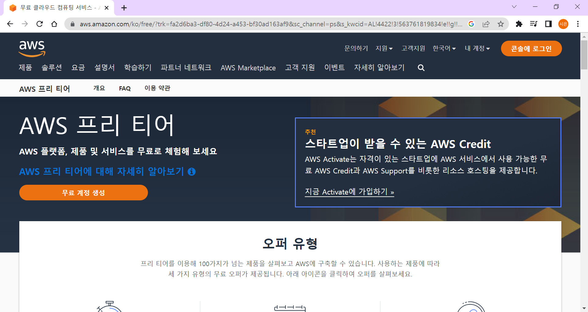
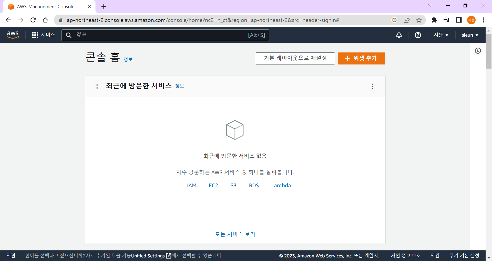
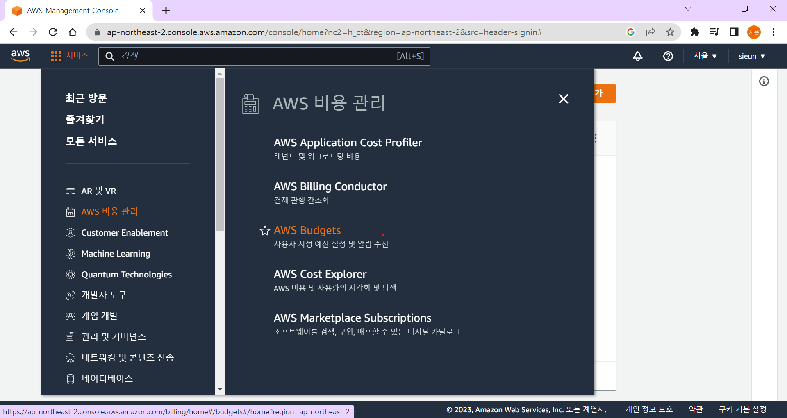
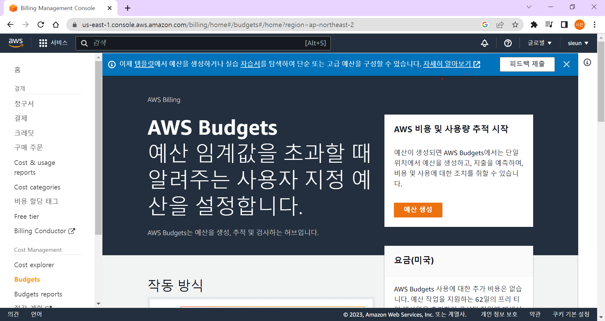
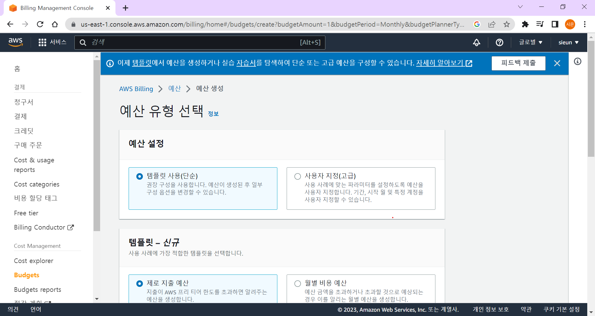
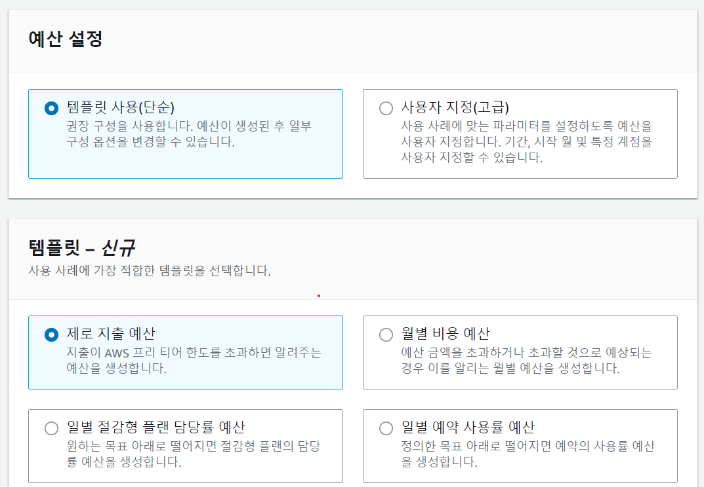
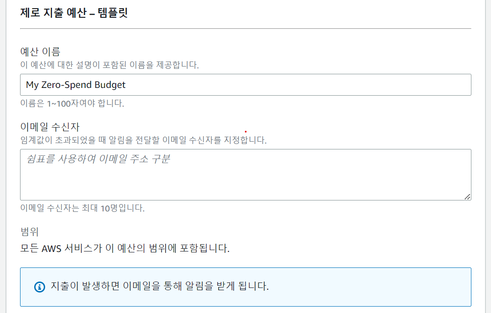
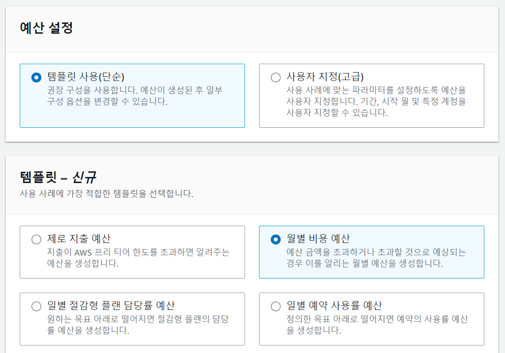
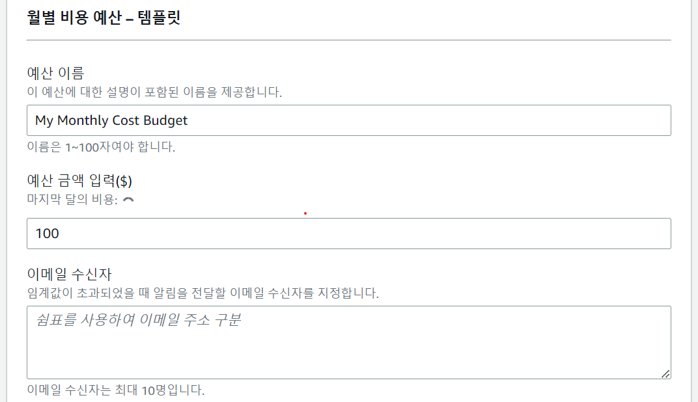

> AWS Budgets 설정 방법을 알아보자!

AWS는 1년동안 무료로 사용할 수 있는 프리티어 계정을 제공합니다.

하지만! 프리티어도 요금이 부과될 수 있습니다.

이떄, 요금을 계속 모니터링하지 않으면 나도 모르는 사이에 요금이 부과되고 있을 수도 있다는 사실..

오늘은 원활한 요금 모니터링을 위해 일정 예산이 초과되면 메일로 알림이 오게 설정해는 방법을 알아보겠습니다!

 

## AWS 로그인

[AWS](https://aws.amazon.com/ko/free/?trk=fa2d6ba3-df80-4d24-a453-bf30ad163af9&sc_channel=ps&s_kwcid=AL!4422!3!563761819834!e!!g!!aws&ef_id=CjwKCAiAxP2eBhBiEiwA5puhNdP1sxgQf_p6B8qB4EoyZZkurAFLE2CC1gvKu2fIWQoXhW5k31cO1xoC4fAQAvD_BwE:G:s&s_kwcid=AL!4422!3!563761819834!e!!g!!aws&all-free-tier.sort-by=item.additionalFields.SortRank&all-free-tier.sort-order=asc&awsf.Free%20Tier%20Types=*all&awsf.Free%20Tier%20Categories=*all)에 접속해주세요.

 
콘솔에 로그인 버튼을 눌러 로그인을 해주세요!

왼쪽 위의 `서비스`에 들어가셔서 `AWS 비용 관리`, `AWS Budgets`에 들어가주세요!

 

## 예산 생성

`예산 생성` 버튼을 눌러주세요!

`예산 생성` 버튼을 누르면, 이런 화면이 나오게 됩니다.

이제 진짜 예산을 만들고 알림을 오게 만들어 봅시다!!!!!

 

## 예산 설정 - 제로 지출 예산

`제로 지출 예산` 템플릿을 사용하면, 프리티어 한도를 초과하면 이를 메일로 알려줍니다.

즉, 지출이 발생하면 바로 알림을 줍니다.

- 예산 이름: 아무렇게나 지어도 괜찮습니다!
- 이메일 수신자: 이 란에 작성한 메일로 알림이 오기 때문에 꼭 확인이 용이한 메일로 작성해주세요!

 

## 예산 설정 - 월별 비용 예산

`월별 비용 예산` 템플릿을 사용하면, 예산을 직접 설정하고 해당 예산을 초과하면 이를 메일로 알려줍니다.

- 실제 지출이 85%에 도달한 경우
- 실제 지출이 100%에 도달한 경우
- 예상 지출이 100% 도달할 것으로 예상되는 경우

예산 이름과 이메일 수신자는 `제로 지출 예산`과 마찬가지로 동일하게 작성하시면 됩니다.

`예산 금액 입력`에는 예산 설정으로 원하시는 예산 금액을 작성하시면 됩니다.

 

끝!

 

<iframe src="https://giphy.com/embed/9JcIIyYy3Z5m1w0yVE" width="480" height="270" frameBorder="0" class="giphy-embed" allowFullScreen></iframe>

267골의 해리 케인은 전설이다.
