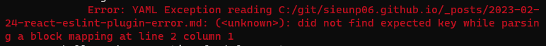
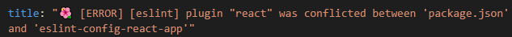
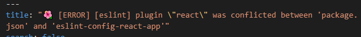

> 왜 포스팅이 안되나 했는데..

<br>

## did not find expected key while parsing a block a block mapping at line 2 column 1 



에러 메세지를 보면 line 2 column 1이 문제라는데, 확인해보니 `title`이었다.

구글링 해보니 제목에 따옴표가 포함되어 있어 발생하는 에러라고 한다.



따옴표를 삭제하라고 하는데 혹시 `\"`로 바꾸면 될까 싶어서 바꿔봤다!




## 에러 원인
- `title`에 따옴표가 포함되어 있어서 발생함.

## 해결 방법
둘 중 하나 선택하면 될 것 같다!

- 따옴표를 삭제한다.
- `"`를 `\"`로 변경한다.
  - 전
    ```
    title: 따옴표를 "따옴표"
    ```
  - 후
    ```
    title: 따옴표를 \"따옴표\"
    ```


Reference
- https://younginshin115.github.io/debug/1-debug-blog4/