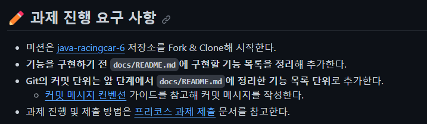

> Angular.Js Git Commit Message Conventions 그게 뭔데!

# Angular.Js Git Commit Message Conventions

우테코 프리코스 2주차 `자동차 경주` 미션의 과제 진행 요구 사항에 Git 커밋에 대한 사항이 추가되었다.

나.. `Udacity Git Commit Message Style Guide`만 알고 있던 사람.. `Angular.Js Git Commit Message Conventions`..? 그게 뭔데ㅔㅔㅔㅔ



`Angular.Js Git Commit Message Conventions`에 대해 알아보자!!🔥🔥🔥

## Commit Message 형식
`Angular.Js Git Commit Message Conventions`는 아래의 구성을 가지고 있다.
```
<type>(<scope>): <subject>
<BLANK LINE>
<body>
<BLANK LINE>
<footer>
```
각 줄은 가독성을 위해 100자를 넘지 않도록 작성해야 한다.

이제 각 항목에 어떤 내용이 들어가야 되는지 알아보자ㅏㅏㅏ

### `<type>`
- feat (feature)
- fix (bug fix)
- docs (documentation)
- style (formatting, missing semi colons)
- refactor
- test (when adding missing tests)
- chore (maintain)

### `<scope>`
커밋 변화가 일어난 곳들이면 모두 들어갈 수 있다.

### `<subject>`
`subject`는 변경 사항에 대한 간단한 설명이 들어간다.

아래 세 가지 조건을 지켜 작성해야 한다.
- 현재 시제, 명령어로 작성한다.
- 첫 번째 글자를 대문자로 작성하지 않는다.
- 마지막에 점(.)을 붙이지 않는다.

### `<body>`
`body`에는 변경에 대한 동기와 전과 비교하여 어떤 것이 달라졌는지에 대해 작성한다.

`subject`와 동일하게 현재 시제, 명령어로 작성해야 한다.

### `<footer>`
#### `breaking changes`
모든 변경점들을 변겸점, 변경 사유, migration 지시와 함께 `footer`에 작성한다.

#### `referencing issues`
해결 된 이슈는 `footer`의 독립된 줄에 `Closes`라는 키워드와 함께 작성한다.
```
Closes #234
```
해결 된 이슈가 여러 개라면 이런 식으로 작성해도 된다.
```
Closes #234, #235, #236
```

\+ `Angular 9`에서는 `Closes` 대신 `Fixes`를 사용하기도 한다.

# references
- [the AngularJS commit conventions](https://gist.github.com/stephenparish/9941e89d80e2bc58a153)