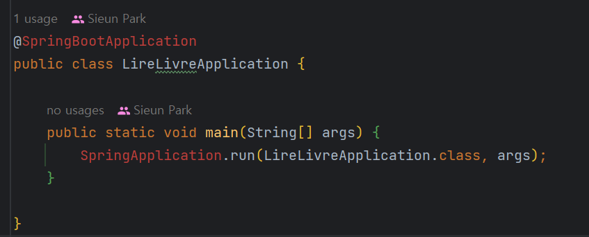
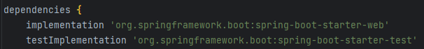
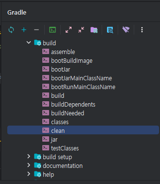
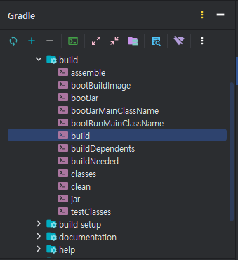
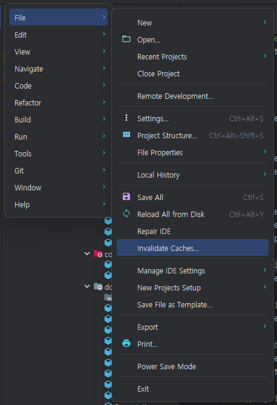
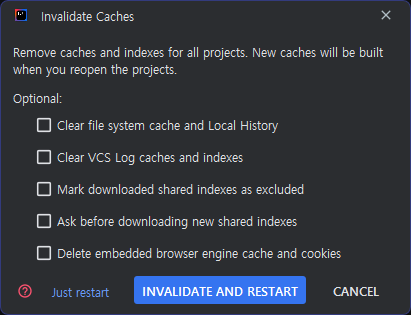
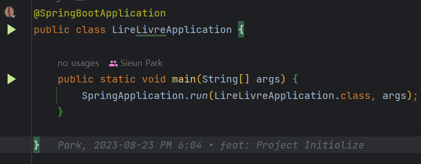

> 갑자기 왜 이러셔

팀원들의 개인 사정으로 잠시 중단되어 있던 프로젝트를 다시 시작하기 위해 오랜만에 프로젝트를 열었더니 위 사진과 같이 `springframework` 쪽의 import 부분 모두 빨간 줄 처리 되어 있었다.

import에서 오류가 발생하는 것으로 보여 `gradle.build`를 살펴봤는데, 딱히 문제가 발견되지 않았다.

### 방법 1. Gradle clean - build
나 같은 경우 이 방법을 통해 해결했는데, gradle.build 쪽이 의심이 되니 혹시나 싶어 Gradle을 clean 후 build 시키니 해결됐다.

> 📌 Reload All Gradle Projects를 통해서도 가능하다.

### 방법 2. Gradle Cache 초기화
이 방법은 구글링을 통해 알게 되었다.

Invalidate And Restart 을 누르면 캐시를 무효화하고 재시작한다.

### 해결!

