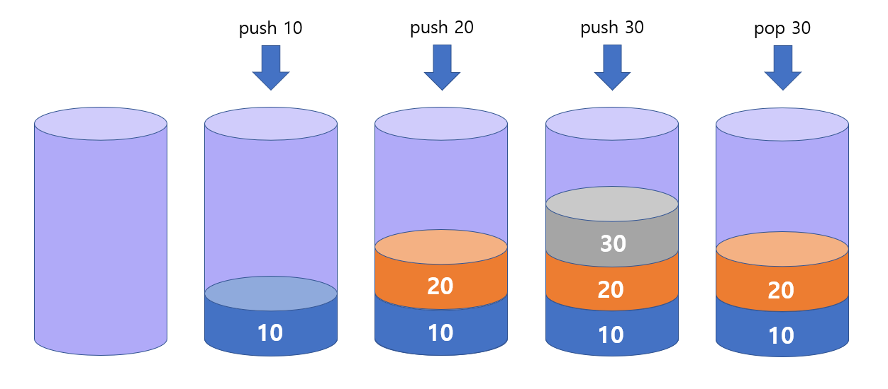

> 까먹지 말자 Java Stack

<br>

# Stack
## Stack의 특징 - LIFO
스택의 가장 큰 특징은 LIFO(Last In First Out, 후입선출)입니다.

LIFO은 후입선출, 그러니까 가장 나중에 들어온 것이 제일 먼저 나간다는 말이죠!

그림으로 보면 이런 느낌입니다.



- push로 값을 넣어 쌓고, pop으로 값을 꺼낼 때는 제일 나중에 넣은, 즉 제일 위에 있는 수를 꺼냅니다.

## Stack 선언
```java
import java.util.Stack;
```
Stack을 사용하기 위해서는 java.util.Stack을 import 해야합니다.

```java
Stack<E> st = new Stack<>();
```
위와 같이 stack을 선언할 수 있습니다!

## Stack의 주요 메서드 

1. push(E item)
    - 스택 맨 위에 item을 추가함.
2. pop(E item)
    - 스택 맨 위의 item을 제거함.
3. peek()
    - 스택 맨 위의 item을 리턴함.
4. size()
    - 스택의 사이즈를 리턴함.
5. empty()
    - 스택이 비었는지 확인함.
    - 스택이 비었으면 true, 비어있지 않으면 false를 리턴함.
6. contains(E item)
    - 스택에 item이 포함되어 있는지 확인함.
    - 포함되어 있으면 true, 없으면 false 리턴함.
7. clear()
    - 스택의 전체 값을 제거함.

- reference: [oracle docs - stack](https://docs.oracle.com/javase/7/docs/api/java/util/Stack.html)