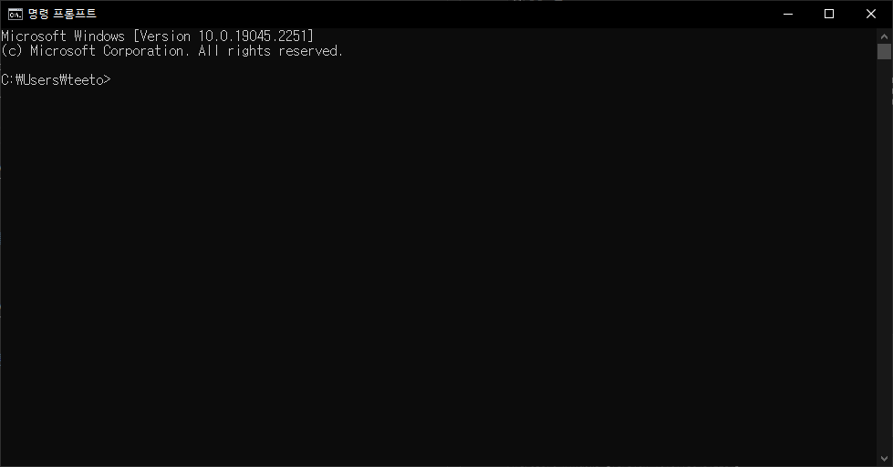
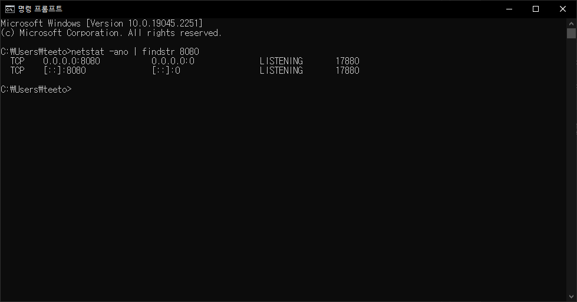
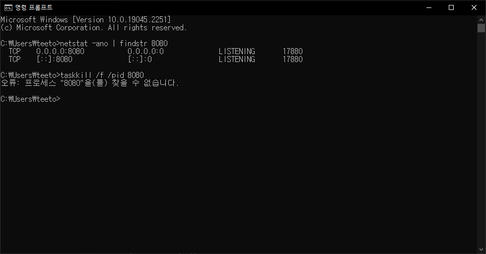
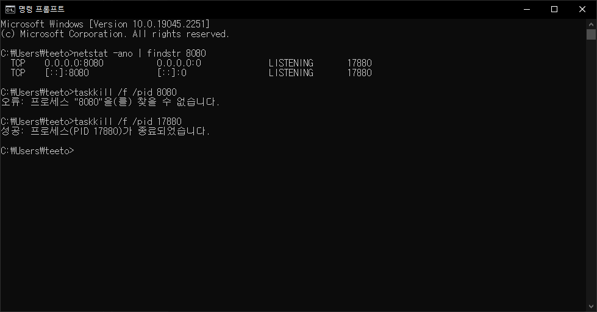

> 사용 중인 포트를 Cmd에서 kill 하는 방법!

## Error
보통 `Port 8080 required by ~~~ is already in use.` 에러가 발생할 때 사용하는 방법이다.

에러 메세지 자체가 포트 8080번이 이미 사용되고 있으니 실행을 시킬거면 지금 실행하는 포트 넘버를 바꾸던가, 아니면 기존에 포트넘버 8080을 사용하는 프로세스를 kill 하라는 것이다.

나 같은 경우 꽤나 자주 보는 에러 중 하나다...ㅎㅎ..

## cmd에서 특정 port 넘버 kill 하는 방법
### 1. cmd를 킨다.



### 2. 찾고자 하는 Port 넘버의 Pid를 찾는다.
```
netstat -ano | findstr [찾고자 하는 port 넘버]
```


나 같은 경우 8080 Port가 궁금했으니, `netstat -ano | findstr 8080`을 입력해줬다.

우리가 찾는 pid는 제일 오른쪽에 있는 `17880`이다.

### 3. Port 넘버의 Pid를 taskkill 한다.
```
taskkill /f /pid [kill하고자 하는 pid]
```

- <strong>❌ pid가 아닌 port 넘버를 입력하는 경우!</strong>
    
    올바른 예시에 앞서 올바르지 않은 예시를 먼저 들겠다.

    제목처럼 pid자리에 pid를 입력하지 않고 port 번호를 입력하는 경우!

    사실 가끔 아무 생각 없이 하면 하는 실수다.(경험담)
    ```
    taskkill /f /pid 8080
    ```

    

    앗! 찾을 수가 없단다! pid를 입력하지 않고 port 넘버를 입력했기 때문에!
- <strong>⭕ 올바른 예시!</strong>
    

    성공적으로 port가 kill 되면 `성공: 프로세스(PID [PID])가 종료되었습니다.`라는 문구가 나온다.


<br>

끝!