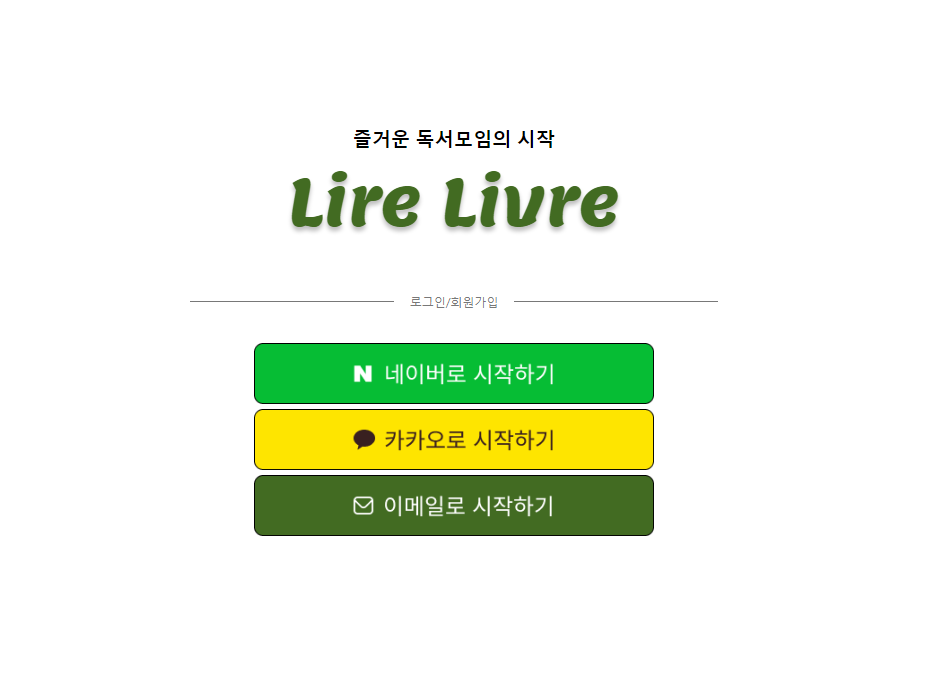
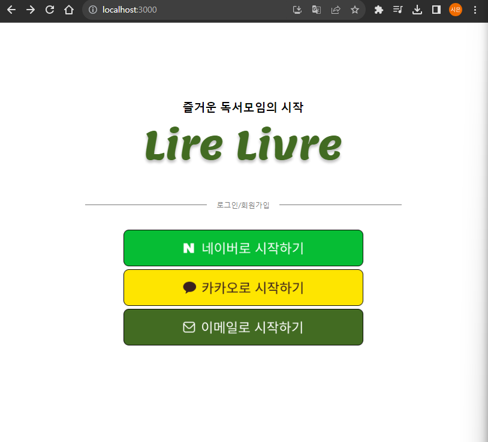
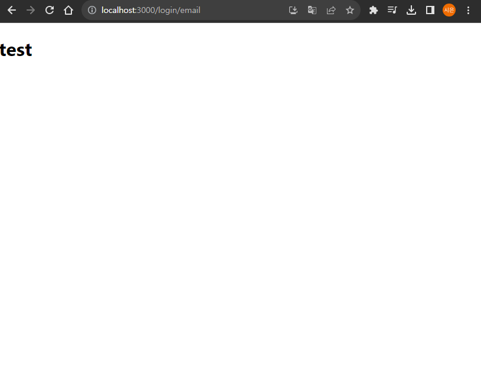
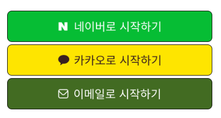
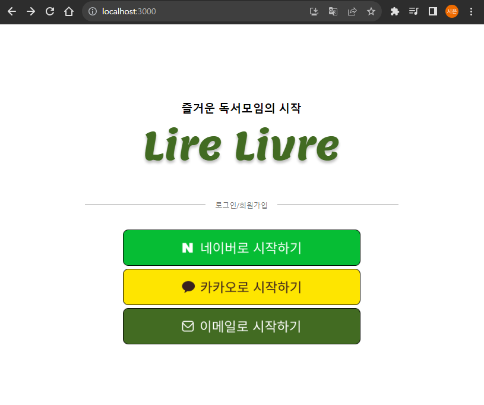
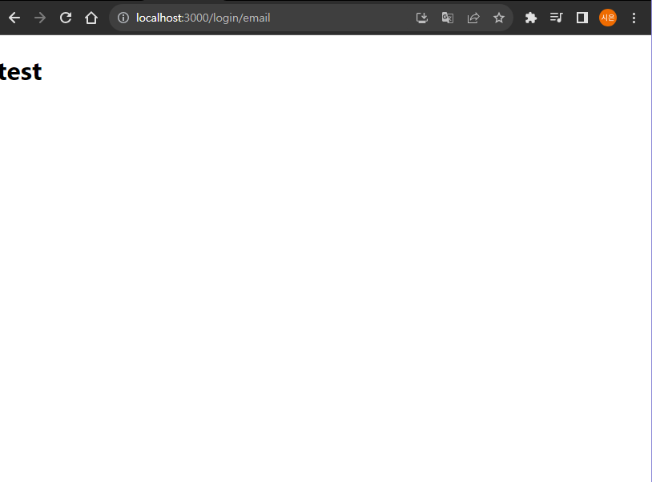

> react-router-dom을 사용해보자!

# react-router-dom

React는 [[SPA(Single Page Application)]] 방식을 기반으로 하고 있기 때문에, SPA에서 화면 전환을 위해 사용하는 모인 `react-router-dom`이 필요하다.

`react-router-dom`을 사용해 소셜 로그인 페이지에서 이메일 로그인 페이지로 이동할 수 있도록 구현해 볼 예정이다.
# react-router-dom 사용해보기
## react-router-dom 설치
둘 중 하나를 터미널에 입력해 `react-router-dom`을 설치할 수 있다.
```
npm install react-router-dom
```
```
yarn add react-router-dom
```

## BrowserRouter와 Routes 그리고 Route
현재 미리 구현해 둔 소셜 로그인 페이지만 있는 상황이다. 
아래 이미지를 보면 `네이버로 시작하기`, `카카오로 시작하기`, `이메일로 시작하기` 세 가지 로그인 방식이 있다.
우선 이 글에서는 `이메일로 시작하기` 버튼을 누르면 이메일로 로그인할 수 있도록 페이지를 이동하게 만들 것이다.



현재 `App.js`에는 `SocialLoginPage`만 덩그라니 혼자 있다.
```jsx
// 📄App.js
import React from 'react';
import SocialLoginPage from './page/Login/SocialLoginPage';

function App () {
	return (
		<SocialLoginPage></SocialLoginPage>
	);
}

export default App;
```

`react-router-dom`을 사용하기 위해 위 코드를 아래 코드처럼 변경하였다.
```jsx
// 📄App.js
import React from 'react';
import SocialLoginPage from './page/Login/SocialLoginPage';
import { BrowserRouter, Routes, Route } from 'react-router-dom';
import EmailLoginPage from './page/Login/EmailLoginPage';

function App () {
	return (
		<BrowserRouter>
			<Routes>
				<Route path="/" element={<SocialLoginPage />} />
				<Route path="/login/email" element={<EmailLoginPage />} />
			</Routes>
		</BrowserRouter>
	);
}

export default App;
```
`BrowserRouter`, `Router`, `Route`가 추가되었다.
세 태그들을 차근차근 알아보자!
### BrowserRouter 태그
`BrowserRouter` 태그는 HTML5의 History API(pushState, replaceState, popstate event)를 사용하여 페이지 새로고침 없이 주소를 변경할 수 있도록 해준다.

`react-router-dom`을 적용해주고 싶은 컴포넌트의 최상위 컴포넌트를 감싸주는 컴포넌트기 때문에, 위처럼 최상위에 위치시켜주었다.

### Routes 태그와 Route 태그
`Routes` 태그는 자식 `Route` 들을 묶는 단위로, `Route` 컴포넌트들을 묶고 있는 것을 볼 수 있다.

`Route` 태그는 주소에 따라 다른 화면을 보여주는 라우팅 기능을 가진 컴포넌트로, 아래 형태로 작성해야 한다.
```jsx
<Route path="[address]" component={[컴포넌트 명]}
```
```jsx
<Route path="/" component={<SocialLoginPage />} />
```
- **path**: URL 경로
- **component**: 해당 URL에서 렌더링될 컴포넌트

### 결과
`BrowserRouter`와 `Routes` 그리고 `Route`를 이용하여 라우팅을 구현해보았다. 

구현한대로라면 `"/"`에 `SocialLoginPage`, `"/login/email"`에 `EmailLoginPage`가 나타나야 한다.



우선 `"/"`에는 구현해둔 `SocialLoginPage`가 잘 렌더링 되는 것을 확인할 수 있다.



`"/login/email"`에도 `EmailLoginPage`가 잘 나타난다!
(위 화면은 아직 구현하지 않았다.)

하지만 내가 원하는 방향인 `이메일로 시작하기` 버튼을 누르면 `EmailLoginPage`가 나타나는 것이 아닌, 해당 URL을 입력해야 `EmailLoginPage`를 볼 수 있다.

이는 `Link`를 사용하면 구현할 수 있다.
## Link
```jsx
// 📄 SocialButton.jsx
import React from "react";
import styled from "styled-components";
import Button from "../atom/Button";

const StyledDiv = styled.div`
    margin-top: 2rem;
`;

function SocialButtons() {
    return (
        <StyledDiv>
            <Button type="social" platform="naver"></Button>
            <Button type="social" platform="kakao"></Button>
            <Button type="social" platform="email"></Button>
        </StyledDiv>
    );
}

export default SocialButtons;
```
위 코드는 아래 이미지처럼 세 버튼을 구현한 코드이다.



나는 위 세 버튼 중 `이메일로 시작하기` 버튼을 클릭하면 `EmailLoginPage`로 이동하도록 만들고 싶다. 

위  `📄 SocialButton.jsx`를 아래처럼 변경한다.

```jsx
import React from "react";
import { Link } from "react-router-dom";
import styled from "styled-components";
import Button from "../atom/Button";

const StyledDiv = styled.div`
    margin-top: 2rem;
`;

function SocialButtons() {
    return (
        <StyledDiv>
            <Button type="social" platform="naver"></Button>
            <Button type="social" platform="kakao"></Button>
            <Link to="/login/email">
                <Button type="social" platform="email"></Button>
            </Link>
        </StyledDiv>
    );
}

export default SocialButtons;
```
`Email로 시작하기` 버튼을 구현한 코드에 `Link`라는 태그가 추가되었다.

`Link` 태그는 클릭했을 때 다른 주소로 이동하는 과정에서 기존의 상태를 유지하며 `History API`만을 사용해서 페이지의 주소만을 바꿔준다.

즉, `"/"`에서 `Email로 시작하기` 버튼을 눌렀을 때, URL을 `"/login/email"`로 변경해주고 `Route`가 그 주소에 해당하는 컴포넌트를 출력해주는 것이다.
```jsx
<Link to="{이동할 URL}"></Link>
```

### 결과
`Link` 태그를 사용하여 `이메일로 시작하기` 버튼을 눌렀을 때, `EmailLoginPage`가 나타날 수 있도록 변경하였다.



해당 화면에서 이메일로 시작하기 버튼을 누르면 URL이 `localhost:3000/login/email`로 변경되며 `EmailLoginPage`이 나타난다.



# Reference
- https://jinyisland.kr/post/react-router/
- https://velog.io/@pkbird/React-Router-1
- https://velog.io/@wiostz98kr/TIL49-l-React-%EB%A6%AC%EC%95%A1%ED%8A%B8-%EB%9D%BC%EC%9A%B0%ED%84%B0React-Router-%EC%82%AC%EC%9A%A9%ED%95%98%EA%B8%B0-Feat.-SPA