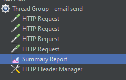
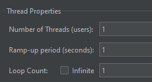
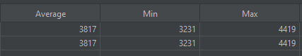
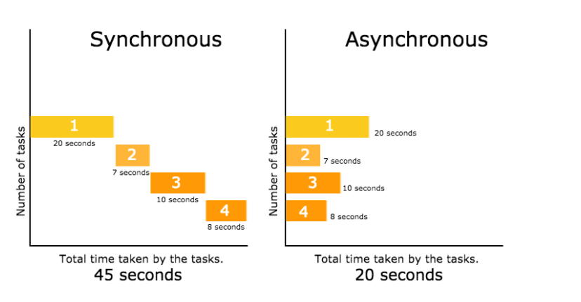
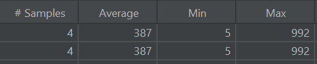

회원가입 시 이메일 인증 기능곽 비밀번호 찾기 기능에서 사용하는 이메일 전송 기능이 느렸던 것이 생각나 생각난 김에 개선 작업을 하게 되었다.

JMeter에서 다음과 같은 시나리오를 통해 테스트를 진행하였다.








4개의 이메일에 대해서 1개의 스레드에서 한 번의 요청만 보낼 수 있도록 설정했다.

4개의 이메일에만 테스트했기 때문에 좀 아쉽긴 하지만 테스트 결과 다음과 같은 결과가 나왔다.

- 평균: 3817ms
- 최소: 3231ms
- 최대: 4419ms

또한 4번의 요청에 대한 응답을 받기 위해 총 15초의 시간이 소요되었다.

메일을 전송하는 부분을 비동기로 처리하도록 변경하기로 하였다.

---

# 동기(Asynchronous)와 비동기(Asynchronous) 처리



## 동기(Synchronous) 처리

> 요청을 보낸 후 응답이 올 때까지 기다리는 방식
> 

모든 작업이 순차적으로 진행되며 어떤 작업이 실행 중이라면 다음 작업은 대기하게 된다.

## 비동기(Asynchronous) 처리

> 요청을 보낸 후 응답을 기다리지 않고 다음 작업을 실행하는 방식
> 

시간이 오래 걸리는 작업은 백그라운드에서 처리되고, 완료되면 콜백(callback), Future, Promise, 이벤트 등으로 결과를 통보한다.

# Spring boot에서의 비동기 처리

## Spring boot에서의 비동기 처리 동작 방식

Spring boot에서는 이러한 비동기 처리를 멀티 스레드 방식으로 구현한다.

1. **메인 스레드**
    - 클라이언트 요청을 받아 컨트롤러나 서비스 메서드를 실행시킨다.
2. **@Async 메서드 호출**
    - `@Async`가 붙은 메서드를 호출하면, 스프링은 바로 실행하지 않고 `ThreadPoolTaskExecutor`라는 스레드풀에 작업을 위임한다.
3. **별도 스레드에서 실행**
    - 스레드풀에서 비어 있는 스레드를 찾아서 해당 메서드를 실행시킨다.
    - 메인 스레드는 결과를 기다리지 않고 다음 작업을 바로 진행한다.
4. **결과 처리**
    - `Future`, `CompletalbeFuture` 반환 - 나중에 결과를 반환할 수 있다.
    - `void` 반환 - 불쏘시개(fire-and-forget) 방식으로 실행하고 끝낸다.

## @EnableAsync와 @Async 어노테이션

Spring boot에서 다음 두 가지 어노테이션을 통해 비동기 처리를 구현할 수 있다.

- `@EnableAsync`
- `@Async`

위 어노테이션을 사용해서 메서드 단위의 비동기 처리를 구현할 수 있다.

### @EnableAsync

Spring boot 메인 클래스나 `@Configuaration` 클래스 위에 붙이며, 스프링이 비동기 실행 기능을 활성화하도록 지시한다.

```java
@Configuration
@EnableAsync   
public class AsyncConfig {
}
```

내부적으로 `AsyncAnnotationBeanPostProcessor`를 등록해서, `@Async` 메서드를 프록시로 감쌀 준비를 한다.

이때, 이 상태에서 `@Async`를 사용하면 기본 TaskExecutor(`SimpleAsyncTaskExecutor`)를 사용하게 된다.

이를 커스터마이징 해서 사용하지 않으면 스레드가 무제한으로 생성될 수 있다.

때문에 스레드풀 커스터마이징을 해서 사용해야 한다.

```java
@Configuration
@EnableAsync 
public class AsyncConfig {

    @Bean(name = "customExecutor")
    public ThreadPoolTaskExecutor customExecutor() {
        ThreadPoolTaskExecutor executor = new ThreadPoolTaskExecutor();
        executor.setCorePoolSize(5);      // 기본 스레드 개수
        executor.setMaxPoolSize(10);      // 최대 스레드 개수
        executor.setQueueCapacity(100);   // 큐 사이즈
        executor.setThreadNamePrefix("Async-");
        executor.initialize();
        return executor;
    }
}

```

위와 같이 커스터마이징한 스레드풀을 사용하려면 다음과 같이 명시해주면 된다.

```java
@Service
public class MailService {

    @Async("customExecutor") // 지정한 스레드풀 사용
    public void sendMail(String email) {
    }
}

```

### @Async

메서드를 비동기(별도 스레드)에서 실행하도록 표시하는 어노테이션이다.

즉, 호출자는 즉시 반환되고 실제 작업은 TaskExecutor에서 실행된다.

이때, Spring 프록시 기반 AOP기 때문에 해당 메서드를 public으로 선언해야 한다.

```java
@Service
public class MailService {

    @Async
    public void sendMail(String email) {
    }
}

```

@Async가 붙은 메서드는 프록시를 통해 스레드풀에 던져지는데, 이때 반환 타입에 따라 동작이 달라지게 된다.

- `void`
- `Future<T>`
- `CompletableFuture<T>`

---

## 이메일 전송 기능 비동기 처리 전환

다음은 기존에 존재하던 이메일 전송 기능(`sendMail` 메서드)다.

```java
@Service
@RequiredArgsConstructor
public class MailSendService {
    private final JavaMailSender mailSender;

    @Value("${spring.mail.username}")
    private String fromEmail;

    public void sendEmail(MailResponseDto mailResponseDto) {
        SimpleMailMessage message = new SimpleMailMessage();
        message.setTo(mailResponseDto.getEmail());
        message.setFrom(fromEmail);
        message.setText(mailResponseDto.getContent());
        mailSender.send(message);
    }
}

```

이를 비동기 처리하기 위해 `@Async` 어노테이션을 붙이고, `AsyncConfig`에서 스레드풀을 커스터마이징 했다.

```java
@Service
@RequiredArgsConstructor
public class MailSendService {
    private final JavaMailSender mailSender;

    @Value("${spring.mail.username}")
    private String fromEmail;

    @Async("emailExecutor")
    public void sendEmail(MailResponseDto mailResponseDto) {
        SimpleMailMessage message = new SimpleMailMessage();
        message.setTo(mailResponseDto.getEmail());
        message.setFrom(fromEmail);
        message.setText(mailResponseDto.getContent());
        mailSender.send(message);
    }
}
```

```java
@Configuration
@EnableAsync
public class AsyncConfig {

    @Bean(name = "emailExecutor")
    public ThreadPoolTaskExecutor emailExecutor() {
        ThreadPoolTaskExecutor executor = new ThreadPoolTaskExecutor();
        executor.setCorePoolSize(5);
        executor.setMaxPoolSize(10);
        executor.setQueueCapacity(100);
        executor.setThreadNamePrefix("Async-");
        executor.initialize();
        return executor;
    }
}

```

위와 같이 비동기 처리를 했을 때, 개선 전과 동일한 시나리오에서 다음과 같은 결과가 나왔다.




- 평균: 387ms
- 최소: 5ms
- 최대: 992ms

또한 동기로 순차 실행해 4번에 요청에 대해 총 15초가 걸리던 것이 2초로 크게 개선되었다.