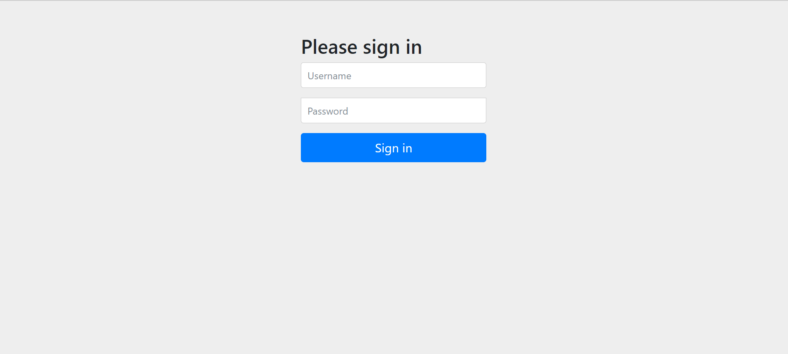
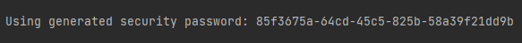
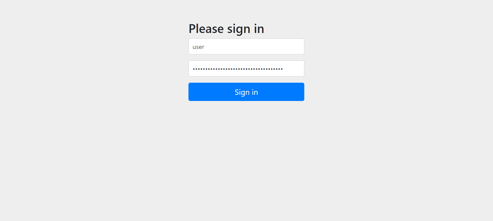
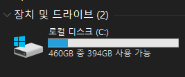

> 이걸 몰라서 컴퓨터 초기화한 사람이 접니다.

 

## 진심으로 당황했던 사람의 서론

어언 7시간이 지난 일입니다..

팀원 분께서 security와 thymeleaf dependency를 추가해주셔서..

저는 그냥 풀을 받고 localhost를 돌린 것이죠..

그런데..!!!!!!!!

(?ㅇ?)???????????????

구현하지도 않은 로그인 화면이 나오는 겁니다!!!!!

안그래도 협업이 익숙하지 않은 저는 진심으로 간담이 서늘했습니다.

물론 협업에는 영향이 없다는 걸 알고 있었지만.. 이 문제가 지속된다면 앞으로의 개발 일정에 매우 큰 차질이 있을 수도 있겠다고 판단했고..

저는 빠르게 결정을 내렸습니다..

`초 기 화`하기로..

(머리가 나쁘면.. 몸이.. 고생.. 읍읍..)

## 해결 방법

사실 해결 방법이라고 하기도 뭐한게, 당연히 나오는 거라고 하더라고요.

혹시 `security depency`를 추가하지 않으셨나요?!

그냥 로그인 화면이 나오면

> 아이디 : user
> 비밀번호 : [콘솔창에 나오는 password 입력]

비밀번호는 이런 식으로 콘솔창에 나옵니다.

(저는 이걸 보고도 왜 몰랐을까요)

이렇게 로그인 하시면 됩니다.

그럼 아마 잘 나오실거에요...

-------------------------

(깨ㅡ끗)

아ㅋㅋ 결과적으로 깨끗하게 정리했으면 됐지 뭐~