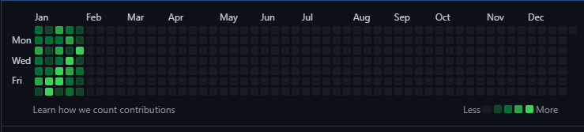

> 1월이 벌써..

 

# 2023년 1월

<iframe src="https://giphy.com/embed/duNowzaVje6Di3hnOu" width="480" height="320" frameBorder="0" class="giphy-embed" allowFullScreen></iframe>

1월이 벌써 다 지나가버렸다(아뿔싸!).

대충 훑어보기만 하자!

 

## 1일 1커밋
새해를 맞아 1일 1커밋을 결심하게 되었다.

내 최대 단점이 꾸준하지 못하다는 점인데(22년째 못고쳤음.)

진짜 정말로 이대로면 안될 것 같아서 나도 할 수 있다고 생각할 수 있도록 뭔가를 꾸준히 해보려고 했다.

그게 1일 1커밋이 되었던 것이다!

### 그래서 1월 한달은?

와 성공!

힝 넘모 뿌듯행..

 

## 알고리즘 공부
### 계기

사실 이번 달 컨셉을 코딩 테스트 공부로 잡았었다.

이제 4학년이다보니, 취업 준비가 코 앞으로 다가왔다는 위기감이 들었기 때문이다.

그래서... 코딩 테스트를 준비하게 되었다. 아 물론 그래봤자 백준 열심히 푸는 정도지만..

### 브론즈 3에서 실버 2

아 근데 진짜 솔직히 말하면 많이 발전했다는 생각이 들었다.

뭐 전과생 어쩌구하는 변명거리들은 있긴 하지만 하여튼 2학년 때에는 브론즈 문제도 힘들었고, 3학년 때에는 알고리즘이나 코딩 테스트 공부를 진득히 할 시간이 없었다.

결론적으로, 불과 1년 전엔 브론즈 문제도 힘들었던 내가 실버 2가 된 것이다...!!!

<iframe src="https://giphy.com/embed/3oz9ZE2Oo9zRC" width="480" height="216" frameBorder="0" class="giphy-embed" allowFullScreen></iframe>

하.. 너무 뿌듯하다.. 

물론물론 내 목표는 골드 1이었지만 이건 롤체로 달성했으니 이 정도에 만족한다!!

 

## 심화 캡스톤, 티키타카
우리 학교는 4학년 1학기 때 심화 캡스톤을 진행한다.

하지만 친구가 없던 나.. 팀을 어떻게 구하지를 삼백번 정도 고민했었다.(사실.. 한 열 번 정도?)

이런 친구 없는 나! 팀을 구했다.

(이얏호!)

1월 한달동안 꽤 많은 횟수의 회의를 진행했고, 이 팀에서 많은 것들을 배울 수 있겠다고 생각했다.

3학년 기초 캡스톤을 진행하면서 서비스 개발을 하지 못한 점에 아주 큰 아쉬움이 있는데 그 아쉬움을 이 팀에서 해소하고 싶다.

꼭 열심히 해서 많이 배웠으면 좋겠고, 좋은 결과 있으면 더 좋고!

 

## 선택과 집중

선택과 집중을 하기로 했다.

소프트웨어 마에스트로에 지원하려고 우아한 테크코스에 떨어진 작년 말부터 결심하고 있었는데, 최근 그 생각을 접기로 했다.

소프트웨어 마에스트로 지원을 포기하기로 한 이유는 두 가지 정도였는데, 뭐 큰 생각은 하지 않고 그냥 여러 상황을 가정해봤었다.

case 1) 코테 2번 다 통과하고 심층면접까지 통과해버림.
  - 어라 나 18학점에 심화캡스톤도 해야되는데..
  - 심화 캡스톤, sw 마에스트로 팀원들 모두에게 팀킬 시전할 수도 있음.

case 2) 자소서 열심히 쓰고 코테 준비하고 대충 준비 열심히 하고 떨어짐.
  - 이 시간에 다른 걸(심화 캡스톤, 개인 공부) 집중했으면 더 좋았겠다.. 라고 생각하고 아쉬워할거 같음.

이런 경위로 내년에 시도해봐도 늦지 않았다고 판단했다. 

그만큼 심화 캡스톤에서 뭔가 경험할 수 있겠다고도 판단했고.

후회할 수도 있겠지만, 후회하는 내가 이 글 봤으면 좋겠다.

> 유감ㅋㅋ 니가 결정한거야~

 

## 블로그

사실 블로그를 개설한 적은 많다.

네이버도 개설했었고.. 티스토리 세번.. 깃헙 블로그도.. 두번 정도..

결국 또 꾸준함이 부족해서 글을 올리지 못했고, 결국 폐쇄를 했었다.

하지만! 물론 1월이 다 지났지만!

이번 2023년, 꼭 블로그를 성실히 운영해서 내가 정말로 공부하고 있다는 증거를 

`확 실 히`

남기고 싶다.

오늘부터라도 열심히 기록도 남기려고 한다!

2월도 화이팅!!!

 

## 해리포터 레거시
나 예구함.

해리포터 가지고 노잼겜 만들면 진짜 레전드임;;;;

라고 해놓고 심히 걱정되는 나..

 

# 2023년 2월 목표를 세워보자.

<iframe src="https://giphy.com/embed/BnpCj4OugA6d989OJr" width="480" height="480" frameBorder="0" class="giphy-embed" allowFullScreen></iframe>

오늘(22R 리버풀전) 데뷔골 넣은 크레이그 도슨

 

## 백준 골드 3 달성
알고리즘 공부? 나 이제 재미 붙였다.

아무도 날 막을 수 없어.

 

## 스프링 부트, AWS 마스터

말하는 감자인 나.

심화 캡스톤에서 민폐를 끼칠 수 없다.

 

## CSTS 공부
작년.. CSTS 시험날이 하필 코로나 격리 해제한 날이였다.

그런데 코로나 후유증으로 어지럼증이 온 나..

시험 보러 가는 길에 너무 어지럽고 토할 것 같아서 다시 집에 갔었다..

증맬루 아쉽고요..

그래서 이번 시험, 꼭 붙는다.

히히 시험은 3월임!

 

> 2월도 화이팅!! 열심히 해보자!!